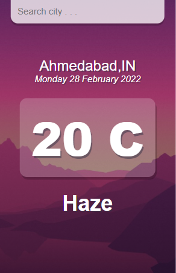
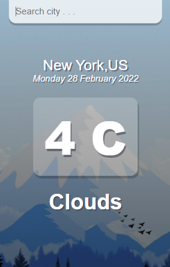

# Weather Web-App
I've made a simple weather web app with help of openweather API. 

Link : https://openweathermap.org/

After npm-start ---> Visit : http://localhost:3000/


Please, refer below screenshots for better understanding.
## Screenshots

#### Here are Screenshots of above web-app

It will show different theme according to different temperatures.





## Installation

Install project with npm

```bash
  npm install react-scripts
  npm start 
```
    
